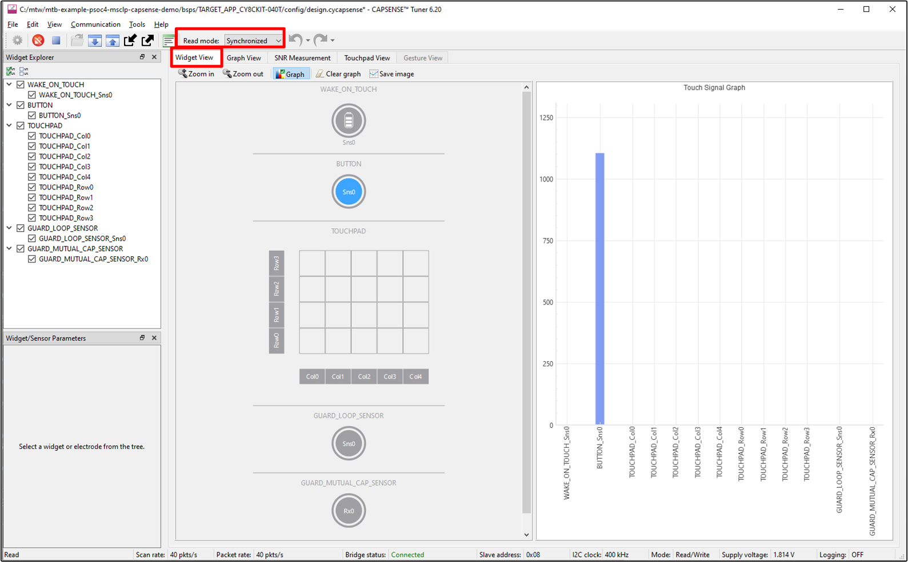
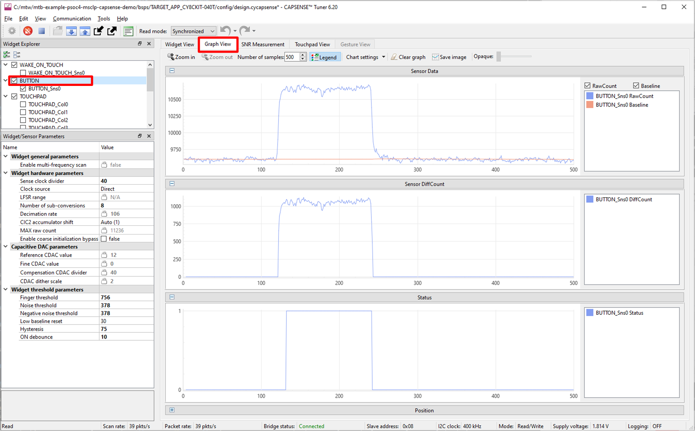
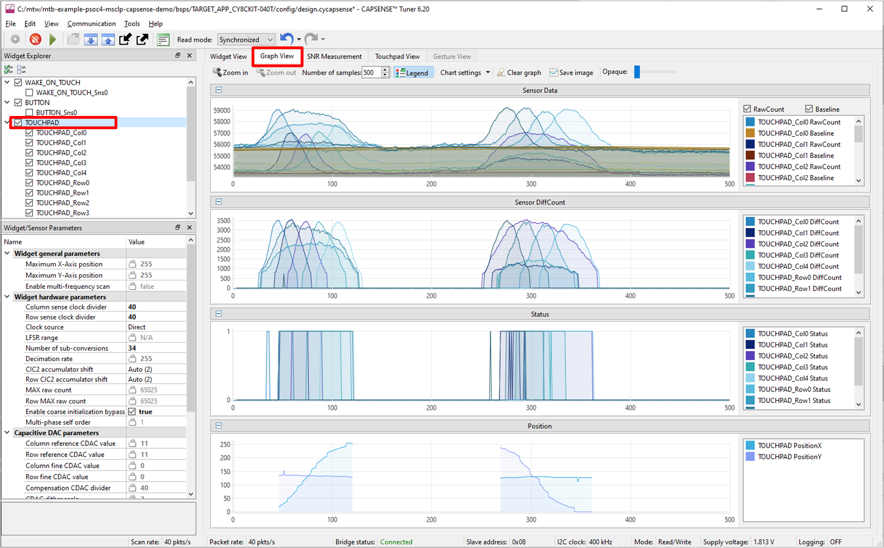
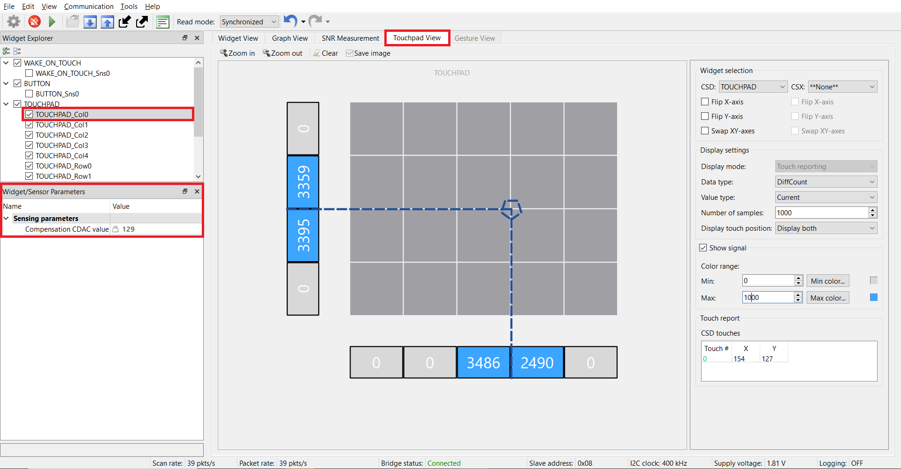
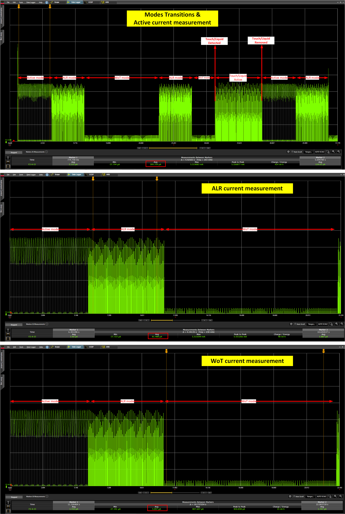
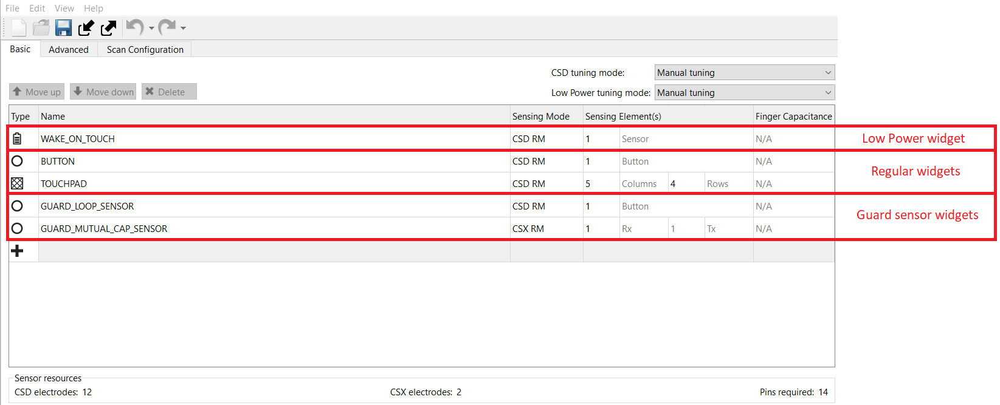
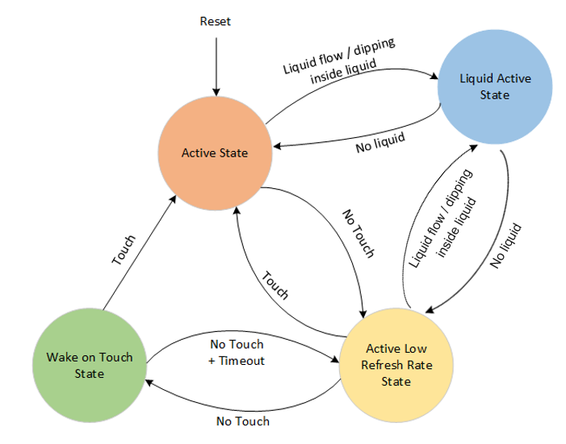
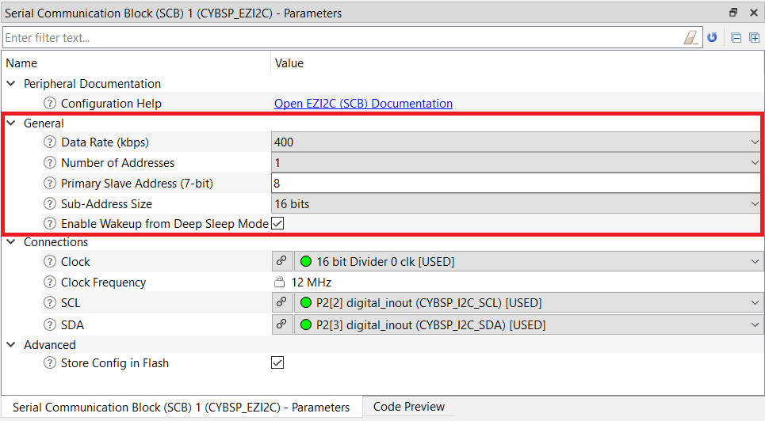
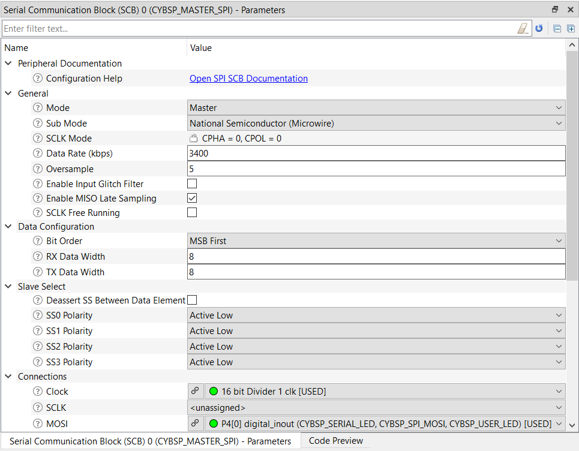

# PSoC&trade; 4: MSCLP robust low-power liquid-tolerant CAPSENSE&trade;

This code example implements a low-power, liquid-tolerant, and robust capacitive sensing solution with the [PSoC&trade; 4000T](www.infineon.com/002-33949) device using the [CY8CKIT-040T CAPSENSE&trade; Evaluation kit](https://www.infineon.com/CY8CKIT-040T).

This code example demonstrates advanced features of multi-sense convertor low-power (MSCLP), the 5th-generation low-power CAPSENSE&trade; block in [PSoC&trade; 4000T](www.infineon.com/002-33949). This kit has onboard capacitive sensors (a self-cap touch button, proximity sensor, and a touchpad) that operate in ultra-low-power mode and only respond to a valid finger touch. The sensors are deactivated when there is any liquid present on the sensors. The kit has onboard LEDs to indicate different touch operations.

Use only the [CY8CKIT-040T CAPSENSE&trade;](https://www.infineon.com/CY8CKIT-040T) kit for testing this code example.

[View this README on GitHub.](https://github.com/Infineon/mtb-example-psoc4-msclp-capsense-demo)

[Provide feedback on this code example.](https://cypress.co1.qualtrics.com/jfe/form/SV_1NTns53sK2yiljn?Q_EED=eyJVbmlxdWUgRG9jIElkIjoiQ0UyMzQ3NTIiLCJTcGVjIE51bWJlciI6IjAwMi0zNDc1MiIsIkRvYyBUaXRsZSI6IlBTb0MmdHJhZGU7IDQ6IE1TQ0xQIHJvYnVzdCBsb3ctcG93ZXIgbGlxdWlkLXRvbGVyYW50IENBUFNFTlNFJnRyYWRlOyIsInJpZCI6InNpZGhhcnRoYSIsIkRvYyB2ZXJzaW9uIjoiMi4wLjAiLCJEb2MgTGFuZ3VhZ2UiOiJFbmdsaXNoIiwiRG9jIERpdmlzaW9uIjoiTUNEIiwiRG9jIEJVIjoiSUNXIiwiRG9jIEZhbWlseSI6IlBTT0MifQ==)

## Requirements

- [ModusToolbox&trade; software](https://www.infineon.com/modustoolbox) v3.1 or later

  **Note:** This code example version requires ModusToolbox&trade; software version 3.1 and is not backward compatible with v3.0 or older versions.

- Board support package (BSP) minimum required version: 3.1.0
- Programming language: C
- Associated parts: [PSoC&trade; 4000T](www.infineon.com/002-33949)

## Supported toolchains (make variable 'TOOLCHAIN')

- GNU Arm&reg; Embedded Compiler v11.3.1 (`GCC_ARM`) - Default value of `TOOLCHAIN`
- Arm&reg; Compiler v6.16 (`ARM`)
- IAR C/C++ Compiler v9.30.1 (`IAR`)

## Supported kits (make variable 'TARGET')

- [PSoC&trade; 4000T CAPSENSE&trade; Evaluation kit](https://www.infineon.com/CY8CKIT-040T) (`CY8CKIT-040T`) - Default value of `TARGET`

## Hardware setup

This example uses the board's default configuration. See the [Kit user guide](www.infineon.com/002-34870) to ensure that the board is configured correctly to use VDDA at 1.8 V.

## Software setup

This example requires no additional software or tools.

## Using the code example

Create the project and open it using one of the following:

<details><summary><b>In Eclipse IDE for ModusToolbox&trade; software</b></summary>

1. Click the **New Application** link in the **Quick Panel** (or, use **File** > **New** > **ModusToolbox&trade; Application**). This launches the [Project Creator](https://www.infineon.com/ModusToolboxProjectCreator) tool.

2. Pick a kit supported by the code example from the list shown in the **Project Creator - Choose Board Support Package (BSP)** dialog.

   When you select a supported kit, the example is reconfigured automatically to work with the kit. To work with a different supported kit later, use the [Library Manager](https://www.infineon.com/ModusToolboxLibraryManager) to choose the BSP for the supported kit. You can use the Library Manager to select or update the BSP and firmware libraries used in this application. To access the Library Manager, click the link from the **Quick Panel**.

   You can also just start the application creation process again and select a different kit.

   If you want to use the application for a kit not listed here, you may need to update the source files. If the kit does not have the required resources, the application may not work.

3. In the **Project Creator - Select Application** dialog, choose the example by enabling the checkbox.

4. (Optional) Change the suggested **New Application Name**.

5. The **Application(s) Root Path** defaults to the Eclipse workspace, which is usually the desired location for the application. If you want to store the application in a different location, you can change the *Application(s) Root Path* value. Applications that share libraries must be in the same root path.

6. Click **Create** to complete the application creation process.

For more details, see the [Eclipse IDE for ModusToolbox&trade; software user guide](https://www.infineon.com/MTBEclipseIDEUserGuide) (locally available at *{ModusToolbox&trade; software install directory}/docs_{version}/mt_ide_user_guide.pdf*).

</details>

<details><summary><b>In command-line interface (CLI)</b></summary>

ModusToolbox&trade; software provides the Project Creator as both a GUI tool and the command-line tool, "project-creator-cli". The CLI tool can be used to create applications from a CLI terminal or from within batch files or shell scripts. This tool is available in the *{ModusToolbox&trade; software install directory}/tools_{version}/project-creator/* directory.

Use a CLI terminal to invoke the "project-creator-cli" tool. On Windows, use the command line "modus-shell" program provided in the ModusToolbox&trade; software installation instead of a standard Windows command-line application. This shell provides access to all ModusToolbox&trade; software tools. You can access it by typing `modus-shell` in the search box in the Windows menu. In Linux and macOS, you can use any terminal application.

The "project-creator-cli" tool has the following arguments:

Argument | Description | Required/optional
---------|-------------|-----------
`--board-id` | Defined in the `<id>` field of the [BSP](https://github.com/Infineon?q=bsp-manifest&type=&language=&sort=) manifest | Required
`--app-id`   | Defined in the `<id>` field of the [CE](https://github.com/Infineon?q=ce-manifest&type=&language=&sort=) manifest | Required
`--target-dir`| Specify the directory in which the application is to be created if you prefer not to use the default current working directory | Optional
`--user-app-name`| Specify the name of the application if you prefer to have a name other than the example's default name | Optional
<br>

The following example clones the "[PSoC&trade; 4: MSCLP robust low-power liquid-tolerant CAPSENSE&trade;](https://github.com/Infineon/mtb-example-psoc4-msclp-capsense-demo)" application with the desired name "MSCLPliquidTolCAPSENSE" configured for the *CY8CKIT-040T* BSP into the specified working directory, *C:/mtb_projects*:

   ```
   project-creator-cli --board-id CY8CKIT-040T --app-id
   mtb-example-psoc4-msclp-capsense-demo --user-app-name MSCLPliquidTolCAPSENSE --target-dir "C:/mtb_projects"
   ```

**Note:** The project-creator-cli tool uses the `git clone` and `make getlibs` commands to fetch the repository and import the required libraries. For details, see the "Project creator tools" section of the [ModusToolbox&trade; software user guide](https://www.infineon.com/ModusToolboxUserGuide) (locally available at *{ModusToolbox&trade; software install directory}/docs_{version}/mtb_user_guide.pdf*).

To work with a different supported kit later, use the [Library Manager](https://www.infineon.com/ModusToolboxLibraryManager) to choose the BSP for the supported kit. You can invoke the Library Manager GUI tool from the terminal using `make library-manager` command or use the Library Manager CLI tool "library-manager-cli" to change the BSP.

The "library-manager-cli" tool has the following arguments:

Argument | Description | Required/optional
---------|-------------|-----------
`--add-bsp-name` | Name of the BSP that should be added to the application | Required
`--set-active-bsp` | Name of the BSP that should be as active BSP for the application | Required
`--add-bsp-version`| Specify the version of the BSP that should be added to the application if you do not wish to use the latest from manifest | Optional
`--add-bsp-location`| Specify the location of the BSP (local/shared) if you prefer to add the BSP in a shared path | Optional

<br>

Following example adds the CY8CKIT-040T BSP to the already created application and makes it the active BSP for the app:

   ```
   library-manager-cli --project "C:/mtb_projects/MSCLPliquidTolCAPSENSE" --add-bsp-name CY8CKIT-040T --add-bsp-version "latest-v4.X" --add-bsp-location "local"

   library-manager-cli --project "C:/mtb_projects/MSCLPliquidTolCAPSENSE" --set-active-bsp APP_CY8CKIT-040T
   ```

</details>

<details><summary><b>In third-party IDEs</b></summary>

Use one of the following options:

- **Use the standalone [Project Creator](https://www.infineon.com/ModusToolboxProjectCreator) tool:**

   1. Launch Project Creator from the Windows Start menu or from *{ModusToolbox&trade; software install directory}/tools_{version}/project-creator/project-creator.exe*.

   2. In the initial **Choose Board Support Package** screen, select the BSP, and click **Next**.

   3. In the **Select Application** screen, select the appropriate IDE from the **Target IDE** drop-down menu.

   4. Click **Create** and follow the instructions printed in the bottom pane to import or open the exported project in the respective IDE.

<br>

- **Use command-line interface (CLI):**

   1. Follow the instructions from the **In command-line interface (CLI)** section to create the application, and then import the libraries using the `make getlibs` command.

   2. Export the application to a supported IDE using the `make <ide>` command.

   3. Follow the instructions displayed in the terminal to create or import the application as an IDE project.

For a list of supported IDEs and more details, see the "Exporting to IDEs" section of the [ModusToolbox&trade; software user guide](https://www.infineon.com/ModusToolboxUserGuide) (locally available at *{ModusToolbox&trade; software install directory}/docs_{version}/mtb_user_guide.pdf*).

</details>

Becasue this project has the necessary settings by default you can go to the [Operation](#operation) section to test the example. If you want to understand the tuning process and follow the stages for this kit or your own board, go to [Tuning procedure](#tuning-procedure) and then test it using the [Operation](#operation) section.

## Operation

1. Connect the USB cable between the [CY8CKIT-040T kit](https://www.infineon.com/CY8CKIT-040T) and the PC as shown in the following image:

    #### **Figure 1. Connecting the CY8CKIT-040T kit with the PC**

    

2. Program the board using one of the following:

   <details><summary><b>Using Eclipse IDE for ModusToolbox&trade; software</b></summary>

      1. Select the application project in the Project Explorer.

      2. In the **Quick Panel**, scroll down, and click **\<Application Name> Program (KitProg3_MiniProg4)**.
      </details>

   <details><summary><b>Using CLI</b></summary>

     From the terminal, execute the `make program` command to build and program the application using the default toolchain to the default target. The default toolchain and target are specified in the application's Makefile but you can override these values manually:
      ```
      make program TARGET=<BSP> TOOLCHAIN=<toolchain>
      ```

      Example:
      ```
      make program TARGET=CY8CKIT-040T TOOLCHAIN=GCC_ARM
      ```
   </details>

3. After programming, the application starts automatically.

   > **Note:** After programming, you see the following error message if debug mode is disabled. This can be ignored or enabling debug solves this error.

   ``` c
   "Error: Error connecting Dp: Cannot read IDR"
   ```

4. Touch any of the sensors with your finger. LEDs turn ON indicating the activation of different CAPSENSE&trade; sensors in the following pattern:

   - LED1 turns ON in blue when the button is touched.
   - LED1 and LED3 turn ON in green when the touchpad is touched.
      - LED1 brightness increases when finger is swiped from left to right.
      - LED3 brightness increases when finger is swiped from bottom to up.

5. For below mentioned liquid tolerance use cases observe that all LEDs are in OFF state indicating that no false trigger occurs due to the presence of water. See kit user guide to know more on the test procedure. 

   - Use a water dropper (shipped with the kit package) to place water droplets on top of the sensors.
   - Spray water over the sensors. 

      #### **Figure 2. Spraying water on top of the sensors**

      
   - Dip the kit in water, upto the immersible line.

      #### **Figure 3. Dipping the kit in water**

      

   - When water is splashed or poured over the kit below the immersible line.
   
      #### **Figure 4. Water splash over the sensors**

      

      #### **Figure 5. Pouring water on top of the sensors**

      

**Note:** Ensure not have water above the immersible line while testing out liquid tolerance.

### Monitor the data using the CAPSENSE&trade; Tuner

1. Open CAPSENSE&trade; Tuner from the 'Tools' section in the IDE Quick Panel.

   You can also run the CAPSENSE&trade; tuner application standalone from *{ModusToolbox&trade; install directory}/ModusToolbox/tools_{version}/capsense-configurator/capsense-tuner*. In this case, after opening the application, select **File** > **Open** and open the *design.cycapsense* file of the respective application, which is present in the *{Application root directory}/bsps/TARGET_APP_\<BSP-NAME>/config/* folder.

	See the [ModusToolbox&trade; user guide](https://www.infineon.com/ModusToolboxUserGuide) (locally available at *{ModusToolbox&trade; install directory}/docs_{version}/mtb_user_guide.pdf*) for options to open the CAPSENSE&trade; tuner application using the CLI.

2. Ensure that the Status LED is ON and not blinking. This indicates that the onboard KitProg3 is in CMSIS-DAP Bulk mode. See [Firmware-loader](https://github.com/Infineon/Firmware-loader) to learn how to update the firmware and switch modes in KitProg3.

3. In the tuner application, click on the **Tuner communication setup** icon or select **Tools** > **Tuner communication setup**. 

   #### **Figure 6. Tuner communication setup**

    

   In the window that appears, select the I2C checkbox under KitProg3 and configure it as follows:

   - I2C address: 8
   - Sub-address: 2 bytes
   - Speed (kHz): 400

   These are the same values set in the EZI2C resource.

   #### **Figure 7. Tuner communication setup parameters**

   

4. Click **Connect** or select **Communication** > **Connect** to establish a connection.

5. Click **Start** or select **Communication** > **Start** to start data streaming from the device.

   The *Widget/Sensor Parameters* tab is updated with the parameters configured in the *CAPSENSE&trade; Configurator* window. The tuner displays the data from the sensor in the **Widget View**, **Graph View**, and **Touchpad View** tabs.

6. Set **Read Mode** to 'Synchronized'. Under the **Widget View** tab, you can see the different sensor widgets highlighted in blue when you touch it.

   #### **Figure 8. Widget view of CAPSENSE&trade; Tuner**

   

7. Go to the **Graph View** tab to view the You can view the raw count, baseline, difference count, and status for each sensor, and touchpad position. To view the sensor data for a button, select **BUTTON_Sns0** under **BUTTON** (see [Figure 9](#figure-9-graph-view-of-button-signals-in-capsense™-tuner)). To view the touchpad sensor data, select **TOUCHPAD_Col0** under **TOUCHPAD** (see [Figure 10](#figure-10-graph-view-of-touchpad-signals-in-capsense™-tuner)).

   #### **Figure 9. Graph view of button signals in CAPSENSE&trade; Tuner**

   

   #### **Figure 10. Graph view of touchpad signals in CAPSENSE&trade; Tuner**

   

8. Go to the **Touchpad View** tab to view the heatmap, which visualizes the finger movement.

   #### **Figure 11. Touchpad view of CAPSENSE&trade; Tuner**

   

9. Go to the **Widget/Sensor Parameters** section in the CAPSENSE&trade; Tuner window. The compensation CDAC values for each touchpad sensor element calculated by the CAPSENSE&trade; resource is displayed as shown in [Figure 10](#figure-10-graph-view-of-touchpad-signals-in-capsense™-tuner).

### Monitor the data using Bridge Control Panel

To observe the CAPSENSE&trade; data at a higher refresh rate and for specific sensors, see [Using Bridge Control Panel to view CAPSENSE&trade; data - KBA237056](www.infineon.com/002-37056).

## Operation at other voltages

[CY8CKIT-040T kit](https://www.infineon.com/CY8CKIT-040T) supports operating voltages of 1.8 V, 3.3 V, and 5 V. Use voltage selection switch available on top of the kit to set the preferred operating voltage and see the [setup the VDDA supply voltage and Debug mode](#set-up-the-vdda-supply-voltage-and-debug-mode-in-device-configurator) section .

This application functionalities are optimally tuned for 1.8 V. However, you can observe the basic functionalities working across other voltages. 

It is recommended to tune application for the preferred voltages for better performance.

### Measure current at different application states

1. Disable the serial LED and tuner macros to measure the current used for CAPSENSE&trade; sensing in each power mode in *main.c* and disable the self test library from the CAPSENSE&trade; configurator as follows:

   ```
      #define ENABLE_SERIAL_LED                (0u)

      #define ENABLE_TUNER                     (0u)
    ```
    
2. Disable the self test library from the CAPSENSE&trade; configurator as follows:

   #### **Figure 12. Disable self test library**

   

3. Disable the debug mode (if enabled). By default, it is disabled. To enable, see the [setup the VDDA supply voltage and Debug mode](#set-up-the-vdda-supply-voltage-and-debug-mode-in-device-configurator) section. Enabling the debug mode keeps the SWD pins active in all device power modes and even during Deep Sleep. This leads to increase in power consumption.

4. Connect the kit to a power analyzer such as KEYSIGHT - N6705C using a current measure header to evaluate the low-power feature of the device as shown in the following [Figure 13](#figure-13-power-analyzer-connectionfigure):

   #### **Figure 13. Power analyzer connection**

   

5. Control the power analyzer device through the laptop using software tool called "Keysight BenchVue Advanced Power Control and Analysis".

6. Select the current measurement option from the instrument control setup. Then select and turn ON output channel as shown in the following [Figure 14](#figure-14-current-measurement-setup):

   #### **Figure 14. Current measurement setup**

   

7. Capture the data using Data log option from the tool. The average Current Consumption is measured using cursors on each power modes as follows.

   #### **Figure 15. Current measurement**

   

8. If there is touch detection on one of the sensors, the device is in Active state. Measure the device current during the active state of operation. If the refresh rate is set to 128 Hz, the approximate device current would be 309 µA when the touchpad is touched (see [Figure 16](#figure-16-power-consumption-profile-of-psoc™-4000t)).

   #### **Figure 16. Power consumption profile of PSoC&trade; 4000T**

   

9. If there is no touch detection on any of the sensors for some time, the CAPSENSE&trade; block moves to a state called "Active Low Refresh Rate (ALR)". If the refresh rate of this state is set to 32 Hz, the approximate device current would be 81 µA.

10. Further inactivity on any of the sensors moves the CAPSENSE&trade; block to the low-power state i.e. Wake On Touch (WoT). The device current in this state is approximately 5 µA if the refresh rate is set to 16 Hz. 

The following table shows the current values measured for VDD=1.8 V:

**Table 1. Device current at different application states**

|  Application state | Refresh rate (Hz) | Current (µA) |
| :--------| :--------| :------------------- |
| Wake-on-touch | 16 | 5 |
| Active Low Refresh rate | 32 | 81 |
| Active | 128 | 309 |

## Tuning procedure

### Create custom BSP for your board

1. Create a custom BSP for your board having any device, by following the steps given in the [ModusToolbox™ BSP Assistant user guide](https://www.infineon.com/dgdl/Infineon-ModusToolbox_BSP_Assistant_1.0_User_Guide-UserManual-v02_00-EN.pdf?fileId=8ac78c8c8386267f0183a972f45c59af). In this code example, it is created for the "CY8C4046LQI-T452" device.

2. Open the *design.modus* file from *{Application root directory}/bsps/TARGET_APP_\<BSP-NAME>/config/* folder obtained in the previous step and enable CAPSENSE&trade; to get the *design.cycapsense* file. The CAPSENSE&trade; configuration can then be started from scratch as follows.

### Tuning parameters

This code example has the optimum tuning parameters of all the sensors. See the following code examples that describe the tuning procedure of different sensors:

1. [CE235178](https://github.com/Infineon/mtb-example-psoc4-msclp-self-capacitance-button) for self-cap button tuning procedure

2. [CE235338](https://github.com/Infineon/mtb-example-psoc4-msclp-self-capacitance-touchpad) for self-cap touchpad tuning procedure

3. [CE235111](https://github.com/Infineon/mtb-example-psoc4-msclp-capsense-low-power) for tuning the low-power widget of the PSoC&trade; 4000T device

# Debugging

You can debug this project to step through the code. In the IDE, use the **\<Application Name> Debug (KitProg3_MiniProg4)** configuration in the **Quick Panel**. For details, see the "Program and debug" section in the [Eclipse IDE for ModusToolbox&trade; software user guide](https://www.infineon.com/MTBEclipseIDEUserGuide).

By default, the debug option is disabled in the device configurator. To enable the debug option, see the [Setup VDD and Debug mode](#set-up-the-vdda-supply-voltage-and-debug-mode-in-device-configurator) section. To achieve low power consumption, it is recommended to disable it. 

## Design and implementation

The project uses the [CAPSENSE&trade; middleware](https://infineon.github.io/capsense/capsense_api_reference_manual/html/index.html); see the [ModusToolbox&trade; software user guide](https://www.infineon.com/ModusToolboxUserGuide) for more details on selecting a middleware.

See [AN85951 - PSoC&trade; 4 and PSoC&trade; 6 MCU CAPSENSE&trade; design guide](https://www.infineon.com/an85951) for more details of CAPSENSE&trade; features and usage.

The design has a ratiometric implementation of the following sensors, as shown in [Figure 17](#figure-17-widgets-in-capsense™-configurator).

1. One Wake-On-Touch widget (1 element), also called "low-power widget"

2. One self-capacitance button widget (1 element)

3. One touchpad widget with 9 elements (4 rows and 5 columns)

4. Proximity sensor of the board configured as a self-capacitance guard sensor (1 element)

5. Proximity sensor of the board configured as a mutual-capacitance guard sensor (1 element)

#### **Figure 17. Widgets in CAPSENSE&trade; Configurator**



The design also has an EZI2C peripheral and a SPI master peripheral.

The EZI2C slave peripheral is used to monitor the information of sensor raw and processed data on a PC using the CAPSENSE&trade; Tuner available in the Eclipse IDE for ModusToolbox&trade; via I2C communication.

The MOSI pin of the SPI slave peripheral is used to transfer data to the three serially connected LEDs for controlling color, brightness, and ON/OFF operation.

This project uses the self-capacitance and mutual-capacitance guard sensors to detect the presence of liquid on the board. Below mentioned liquid tolerance use cases can be detected using this project:

- Dipping kit in water
- Spraying water over the sensors
- Presence of water droplets on top of the sensors
- Pouring water over the kit
- Water splash over the kit

The firmware is designed to support the following CAPSENSE&trade; states by using the PSoC&trade; 4000T device:

- Active state
- Active Low Refresh rate state
- Wake-on-touch state
- Liquid active state

#### **Figure 18. State machine showing different CAPSENSE&trade; states**



The firmware state machine and the operation of the device in four different states are explained in the following steps:

1. Initializes and starts all hardware components after reset.

2. The device starts CAPSENSE&trade; operation in the Active state. The following steps will occur in this state:

   1. The device scans all CAPSENSE&trade; sensors present on the board.

   2. During the ongoing scan operation, the CPU moves to the deep sleep state.

   3. The interrupt generated on scan completion wakes the CPU, which processes the sensor data and transfers the data to CAPSENSE&trade; Tuner through EZI2C.

   4. Turns on the serial LED with specific colors and patterns to indicate the specific touch operation.

   In Active state, a scan of the selected sensors happen with the highest refresh rate of 128 Hz.

3. Enters the Active low-refresh rate state when there is no touch detected for a timeout period. In this state, a scan of selected sensors happens with a lower refresh rate of 32 Hz. Power consumption in the Active low-refresh rate state is lower compared to the Active state. The state machine returns to the Active state if there is any touch detected on any sensor.

4. Enters the Wake-on-touch state when there is no touch detected in the Active low-refresh rate state for a timeout period. In this state, the CPU completely moves to deep sleep, and doesn't get involved in CAPSENSE&trade; operation. This is the lowest power state of the device. In the Wake-on-touch state, the CAPSENSE&trade; hardware executes the scanning of the selected sensors called "low-power widgets" and processes the scan data for these widgets. If any touch detected, the CAPSENSE&trade; block wakes up the CPU and the device moves to the Active state.

5. Enters the 'Liquid Active' state when one of the guard sensors is activated. Then the device moves into the "Liquid Active" state. This state restricts normal scan operation and avoids any false touch by deactivating the scan operation of active sensors. When the liquid is removed from the senor, CAPSENSE&trade; moves to the Active state.

There are three onboard LEDs connected to the SPI MOSI pin of the device. The three LEDs form a daisy-chain connection and the communication happens over the serial interface to create an RGB configuration. The LED accepts a 32-bit input code, with three bytes for red, green, and blue color.

### Set up the VDDA supply voltage and debug mode in Device Configurator

1. Open Device Configurator from the Quick Panel.

2. Go to the **System** tab. Select the **Power** resource, and set the VDDA value under **Operating Conditions** as follows:

   #### **Figure 19. Setting the VDDA supply in system tab of Device Configurator**

   

3. By default, the debug mode is disabled for this application to reduce power consumption. Enable the debug mode to enable the SWD pins as follows:

   #### **Figure 20. Enable debug mode in the System tab of Device Configurator**

   


### Resources and settings

#### **Figure 21. Device Configurator - EZI2C peripheral parameters**

 

<br>

#### **Figure 22. Device Configurator - SPI peripheral parameters for serial LEDs**

 

The following ModusToolbox&trade; software resources are used in this example:

**Table 2. Application resources**

| Resource  |  Alias/object     |    Purpose     |
| :------- | :------------    | :------------ |
| SCB (I2C) (PDL) | CYBSP_EZI2C          | EZI2C slave driver to communicate with CAPSENSE&trade; Tuner  |
| CAPSENSE&trade; | CYBSP_MSCLP0 | CAPSENSE&trade; driver to interact with the MSCLP hardware and interface the CAPSENSE&trade; sensors |
| Digital pin | CYBSP_MASTER_SPI | SPI Master driver to serial LEDs which visualize touchpad and button response |


### Firmware flow

#### **Figure 23. Firmware flowchart**


## Related resources

Resources  | Links
-----------|----------------------------------
Application notes  | [AN79953](https://www.infineon.com/AN79953) - Getting started with PSoC&trade; 4 <br> [AN85951](https://www.infineon.com/AN85951) - PSoC&trade; 4 and PSoC&trade; 6 MCU CAPSENSE&trade; design guide <br> [AN234231](www.infineon.com/002-33949) - Achieving lowest-power capacitive sensing with [PSoC&trade; 4000T
Code examples | [Using ModusToolbox&trade; software](https://github.com/Infineon/Code-Examples-for-ModusToolbox-Software) on GitHub
Device documentation | [PSoC&trade; 4 datasheets](https://www.infineon.com/cms/en/search.html?intc=searchkwr-return#!view=downloads&term=psoc%204&doc_group=Data%20Sheet) <br>[PSoC&trade; 4 technical reference manuals](https://www.infineon.com/cms/en/search.html#!term=psoc%204%20technical%20reference%20manual&view=all)<br>
Development kits | Select your kits from the [Evaluation board finder](https://www.infineon.com/cms/en/design-support/finder-selection-tools/product-finder/evaluation-board) page.
Libraries on GitHub  | [mtb-hal-cat2](https://github.com/Infineon/mtb-hal-cat2) - Hardware abstraction layer (HAL) library
Middleware on GitHub | [capsense](https://github.com/Infineon/capsense) - CAPSENSE&trade; library and documents <br>
Tools | [Eclipse IDE for ModusToolbox&trade; software](https://www.infineon.com/modustoolbox) - ModusToolbox&trade; software is a collection of easy-to-use software and tools enabling rapid development with Infineon MCUs, covering applications from embedded sense and control to wireless and cloud-connected systems using AIROC&trade; Wi-Fi and Bluetooth&reg; connectivity devices.

<br>

## Other resources

Infineon provides a wealth of data at www.infineon.com to help you select the right device, and quickly and effectively integrate it into your design.

## Document history

Document title: *CE234752* - *PSoC&trade; 4: MSCLP robust low-power liquid-tolerant CAPSENSE&trade;*

 Version | Description of change
 ------- | ---------------------
 1.0.0   | New code example
 1.0.1   | Minor readme update
 1.1.0   | Updated code example for improving liquid tolerance
 2.0.0   | Major update to support ModusToolbox&trade; v3.0. This version is not backward compatible with previous versions of ModusToolbox&trade; software.
 3.0.0   | Major update to support ModusToolbox&trade; v3.1 and the BSP changes. This version is not backward compatible with previous versions of ModusToolbox&trade; software.
 3.0.1   | Minor configuration and read me update


---------------------------------------------------------

© Cypress Semiconductor Corporation, 2023. This document is the property of Cypress Semiconductor Corporation, an Infineon Technologies company, and its affiliates ("Cypress").  This document, including any software or firmware included or referenced in this document ("Software"), is owned by Cypress under the intellectual property laws and treaties of the United States and other countries worldwide.  Cypress reserves all rights under such laws and treaties and does not, except as specifically stated in this paragraph, grant any license under its patents, copyrights, trademarks, or other intellectual property rights.  If the Software is not accompanied by a license agreement and you do not otherwise have a written agreement with Cypress governing the use of the Software, then Cypress hereby grants you a personal, non-exclusive, nontransferable license (without the right to sublicense) (1) under its copyright rights in the Software (a) for Software provided in source code form, to modify and reproduce the Software solely for use with Cypress hardware products, only internally within your organization, and (b) to distribute the Software in binary code form externally to end users (either directly or indirectly through resellers and distributors), solely for use on Cypress hardware product units, and (2) under those claims of Cypress's patents that are infringed by the Software (as provided by Cypress, unmodified) to make, use, distribute, and import the Software solely for use with Cypress hardware products.  Any other use, reproduction, modification, translation, or compilation of the Software is prohibited.
<br>
TO THE EXTENT PERMITTED BY APPLICABLE LAW, CYPRESS MAKES NO WARRANTY OF ANY KIND, EXPRESS OR IMPLIED, WITH REGARD TO THIS DOCUMENT OR ANY SOFTWARE OR ACCOMPANYING HARDWARE, INCLUDING, BUT NOT LIMITED TO, THE IMPLIED WARRANTIES OF MERCHANTABILITY AND FITNESS FOR A PARTICULAR PURPOSE.  No computing device can be absolutely secure.  Therefore, despite security measures implemented in Cypress hardware or software products, Cypress shall have no liability arising out of any security breach, such as unauthorized access to or use of a Cypress product. CYPRESS DOES NOT REPRESENT, WARRANT, OR GUARANTEE THAT CYPRESS PRODUCTS, OR SYSTEMS CREATED USING CYPRESS PRODUCTS, WILL BE FREE FROM CORRUPTION, ATTACK, VIRUSES, INTERFERENCE, HACKING, DATA LOSS OR THEFT, OR OTHER SECURITY INTRUSION (collectively, "Security Breach").  Cypress disclaims any liability relating to any Security Breach, and you shall and hereby do release Cypress from any claim, damage, or other liability arising from any Security Breach.  In addition, the products described in these materials may contain design defects or errors known as errata which may cause the product to deviate from published specifications. To the extent permitted by applicable law, Cypress reserves the right to make changes to this document without further notice. Cypress does not assume any liability arising out of the application or use of any product or circuit described in this document. Any information provided in this document, including any sample design information or programming code, is provided only for reference purposes.  It is the responsibility of the user of this document to properly design, program, and test the functionality and safety of any application made of this information and any resulting product.  "High-Risk Device" means any device or system whose failure could cause personal injury, death, or property damage.  Examples of High-Risk Devices are weapons, nuclear installations, surgical implants, and other medical devices.  "Critical Component" means any component of a High-Risk Device whose failure to perform can be reasonably expected to cause, directly or indirectly, the failure of the High-Risk Device, or to affect its safety or effectiveness.  Cypress is not liable, in whole or in part, and you shall and hereby do release Cypress from any claim, damage, or other liability arising from any use of a Cypress product as a Critical Component in a High-Risk Device. You shall indemnify and hold Cypress, including its affiliates, and its directors, officers, employees, agents, distributors, and assigns harmless from and against all claims, costs, damages, and expenses, arising out of any claim, including claims for product liability, personal injury or death, or property damage arising from any use of a Cypress product as a Critical Component in a High-Risk Device. Cypress products are not intended or authorized for use as a Critical Component in any High-Risk Device except to the limited extent that (i) Cypress's published data sheet for the product explicitly states Cypress has qualified the product for use in a specific High-Risk Device, or (ii) Cypress has given you advance written authorization to use the product as a Critical Component in the specific High-Risk Device and you have signed a separate indemnification agreement.
<br>
Cypress, the Cypress logo, and combinations thereof, ModusToolbox, PSoC, CAPSENSE, EZ-USB, F-RAM, and TRAVEO are trademarks or registered trademarks of Cypress or a subsidiary of Cypress in the United States or in other countries. For a more complete list of Cypress trademarks, visit www.infineon.com. Other names and brands may be claimed as property of their respective owners.
